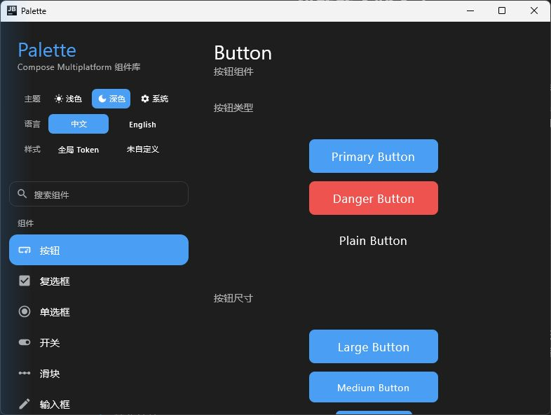
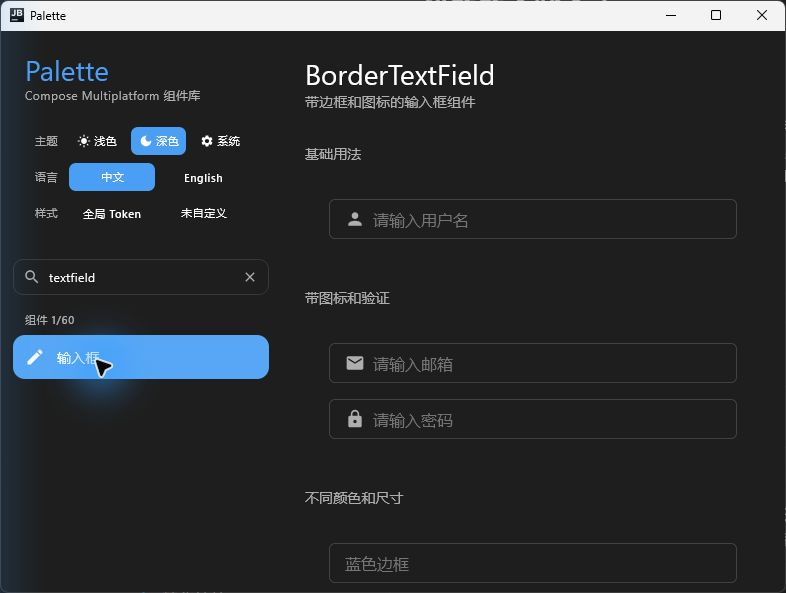
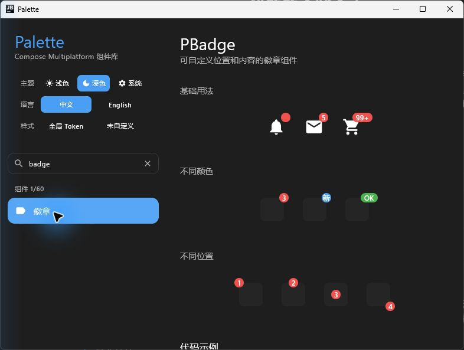
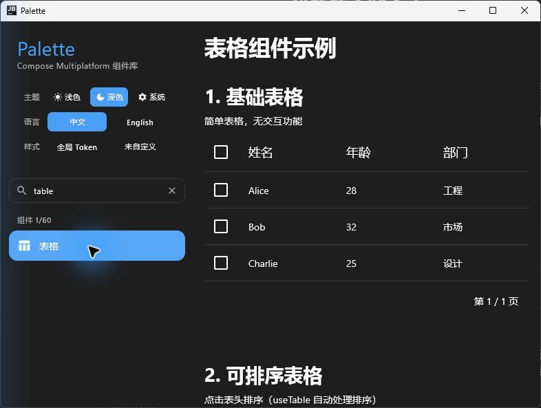
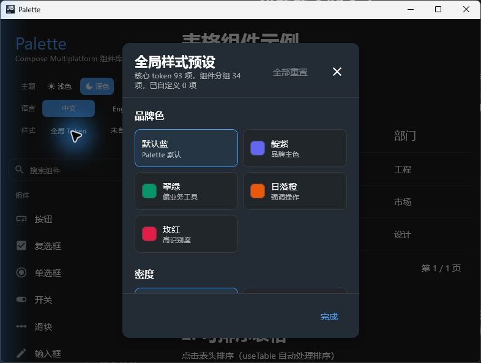

# Palette

Palette is a Compose Multiplatform component library for Android, Desktop (JVM), and iOS. It provides a token-driven theme system, reusable UI components, and a desktop demo app for validating component behavior across light and dark themes.

[中文文档](./README.zh-CN.md)

## Preview

<p>
  
  
</p>

<p>
  
  
</p>

<p>
  
</p>

## Highlights

- **Compose Multiplatform**: shared UI code for Android, Desktop, and iOS targets.
- **Token-first theming**: colors, spacing, shapes, typography, opacity, motion, elevation, and control density are exposed from `PaletteTheme`.
- **Root-level component tokens**: `PaletteComponentThemes` lets product teams tune component styles from the app theme instead of per-instance overrides.
- **Common UI components**: buttons, inputs, selection controls, feedback components, navigation, layouts, data display, and utility components.
- **Demo app**: the `app` module includes searchable component demos, dark/light theme switching, language switching, and global token presets.
- **compose-hooks integration**: the library uses [compose-hooks](https://github.com/junerver/compose-hooks) for React-style state patterns where appropriate.

## Components

The demo app currently groups components into these categories:

| Category | Components |
| --- | --- |
| Form | Button, Checkbox, Radio, Switch, Slider, TextField, Rate, Form, SearchBar, InputNumber, Cascader, Transfer, Calendar, Segmented, InputOTP, Autocomplete, TreeSelect, ColorPicker, Toggle, Mentions, CascaderPanel |
| Feedback | Loading, Progress, Badge, Dialog, Toast, Skeleton, Tag, Popup, ActionSheet, ContextMenu, DashboardProgress, Alert, Popconfirm, Result, InfiniteScroll, Watermark, FloatButton |
| Navigation | Toolbar, Affix, Backtop, PageHeader |
| Layout | RowLayout, BorderBox, Card, Avatar, Collapse, Grid, Space |
| Data display | Table, List, Descriptions, Statistic, Timeline, Tree, Image, Carousel, Pagination, Empty, QRCode |

## Installation

```kotlin
// build.gradle.kts
dependencies {
    implementation("xyz.junerver.compose:palette:0.1.0")
}
```

Palette targets Android `minSdk 24`, Desktop JVM, and iOS `arm64` / `simulatorArm64`.

## Quick Start

```kotlin
import androidx.compose.runtime.Composable
import xyz.junerver.compose.palette.PaletteMaterialTheme
import xyz.junerver.compose.palette.Screen

@Composable
fun MyApp() {
    PaletteMaterialTheme(darkTheme = true) {
        Screen(title = "Hello Palette") {
            // Your content
        }
    }
}
```

## Theming

Palette exposes two theme layers:

1. Core semantic tokens: `PaletteTheme.colors`, `spacing`, `shapes`, `typography`, `opacity`, `motion`, `elevation`, and `control`.
2. Component tokens: `PaletteTheme.componentThemes`, backed by `PaletteComponentThemes`.

Use `derive()` when changing brand colors so dependent semantic colors can be recomputed:

```kotlin
val colors = PaletteColors.light().derive(
    primary = Color(0xFF0057D9),
    surface = Color.White,
)

PaletteMaterialTheme(colors = colors) {
    App()
}
```

Use `PaletteComponentThemes` for root-level component customization:

```kotlin
val colors = PaletteColors.light().derive(primary = Color(0xFF0057D9))
val components = PaletteComponentThemes.default(colors = colors).let { base ->
    base.copy(
        button = base.button.copy(disabledAlpha = 0.56f),
        card = base.card.copy(cornerRadius = 0.dp, elevation = 0.dp),
    )
}

PaletteMaterialTheme(
    colors = colors,
    componentThemes = components,
) {
    App()
}
```

See [docs/theming.md](docs/theming.md) for precedence rules, component token groups, and migration guidance.

## Build And Run

```bash
./gradlew :palette:build
./gradlew :palette:allTests
./gradlew :app:run
./gradlew :app:hotRunDesktop
```

Useful scoped tasks:

```bash
./gradlew :palette:desktopTest
./gradlew :palette:testDebugUnitTest
./gradlew :palette:publishToMavenLocal
./gradlew :palette:desktopBenchmarkBenchmark
```

## Project Structure

```text
Palette/
├── palette/                    # Component library module
│   └── src/
│       ├── commonMain/         # Shared component, token, and theme code
│       ├── commonJvmAndroid/   # JVM + Android shared code
│       ├── androidMain/        # Android-specific implementation
│       ├── desktopMain/        # Desktop-specific implementation
│       └── iosMain/            # iOS-specific implementation
├── app/                        # Demo application
├── docs/                       # Design and migration notes
├── benchmark/                  # Benchmark module
└── art/                        # Screenshots used by the README
```

## Development Notes

- Public APIs are exported from `palette/src/commonMain/kotlin/xyz/junerver/compose/palette/Palette.kt`.
- Component defaults should route major visual decisions through theme tokens or component tokens.
- New components should include an implementation file and an `XxxDefaults.kt` file.
- Component logic changes should include focused tests for normal, edge, and regression paths.

## License

See [LICENSE](LICENSE).
