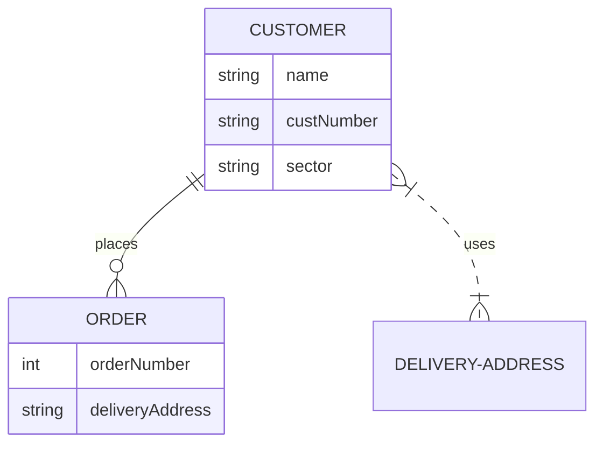

# erDiagram Implementation Plan

> **For agentic workers:** REQUIRED SUB-SKILL: Use compose:subagent (recommended) or compose:execute to implement this plan task-by-task.

**Goal:** Add erDiagram support to palette-mermaid, including models, parser, layout, and rendering.

**Architecture:** Follow the same pattern as classDiagram - models in MermaidModels.kt, parser logic in MermaidParser.kt, layout in MermaidLayoutEngine.kt, rendering in MermaidDiagram.kt.

**Tech Stack:** Kotlin Multiplatform, Compose Multiplatform

## erDiagram Syntax Reference



**Relationship Types:**
- `||--||` : One to One (exactly one)
- `||--o{` : One to Many (zero or more)
- `||--|{` : One to Many (one or more)
- `}o--o{` : Many to Many (zero or more)
- `}o--||` : Many to One (zero or more)
- `}|--||` : Many to One (one or more)
- `}|--|{` : Many to Many (one or more)
- `..--..` : Non-identifying (dashed)

## Global Constraints

- Follow existing code style (no comments unless asked)
- Use `PaletteTheme` tokens for styling
- All existing tests must continue to pass

---

## Task 1: Add erDiagram models to MermaidModels.kt

**Files:**
- Modify: `palette-mermaid/src/commonMain/kotlin/xyz/junerver/compose/palette/mermaid/MermaidModels.kt`

- [ ] **Step 1: Add ErDiagramType to MermaidDiagramType enum**

```kotlin
enum class MermaidDiagramType {
    Flowchart,
    Sequence,
    ClassDiagram,
    ErDiagram,
}
```

- [ ] **Step 2: Add erDiagram models**

Add after ClassDiagram models:

```kotlin
// ── ER Diagram models ──────────────────────────────────────────────

data class ErEntity(
    val name: String,
    val attributes: List<ErAttribute> = emptyList(),
    val sourceRange: MermaidSourceRange? = null,
)

data class ErAttribute(
    val name: String,
    val type: String,
    val comment: String? = null,
    val isPrimaryKey: Boolean = false,
)

enum class ErRelationshipKind {
    OneToOne,
    OneToManyZeroOrMore,
    OneToManyOneOrMore,
    ManyToManyZeroOrMore,
    ManyToManyOneOrMore,
    ManyToOneZeroOrMore,
    ManyToOneOneOrMore,
    NonIdentifyingOneToOne,
    NonIdentifyingOneToMany,
    NonIdentifyingManyToOne,
    NonIdentifyingManyToMany,
}

data class ErRelationship(
    val from: String,
    val to: String,
    val kind: ErRelationshipKind,
    val label: String? = null,
    val sourceRange: MermaidSourceRange? = null,
)
```

- [ ] **Step 3: Add erDiagram fields to MermaidDiagram**

```kotlin
data class MermaidDiagram(
    // ... existing fields ...
    val erEntities: List<ErEntity> = emptyList(),
    val erRelationships: List<ErRelationship> = emptyList(),
)
```

- [ ] **Step 4: Run tests**

Run: `.\gradlew.bat :palette-mermaid:desktopTest --no-daemon`
Expected: PASS

- [ ] **Step 5: Commit**

```bash
git add palette-mermaid/src/commonMain/kotlin/xyz/junerver/compose/palette/mermaid/MermaidModels.kt
git commit -m "feat: add erDiagram models"
```

---

## Task 2: Add erDiagram parser to MermaidParser.kt

**Files:**
- Modify: `palette-mermaid/src/commonMain/kotlin/xyz/junerver/compose/palette/mermaid/MermaidParser.kt`

- [ ] **Step 1: Add erDiagram parsing in main parse loop**

Find where `classDiagram` is handled (around line 48) and add:

```kotlin
if (line.equals("erDiagram", ignoreCase = true)) {
    type = MermaidDiagramType.ErDiagram
    direction = MermaidDirection.TopDown
    return@forEachIndexed
}
```

- [ ] **Step 2: Add erDiagram entity/relationship parsing**

In the `if (type == MermaidDiagramType.ErDiagram)` block:

```kotlin
if (type == MermaidDiagramType.ErDiagram) {
    // Try to parse entity with attributes: ENTITY_NAME { ... }
    val entityMatch = Regex("""^(\w+)\s*\{""").matchEntire(line)
    if (entityMatch != null) {
        currentErEntity = entityMatch.groupValues[1]
        currentErAttributes = mutableListOf()
        return@forEachIndexed
    }

    // Inside entity block
    if (currentErEntity != null) {
        if (line.trim() == "}") {
            erEntities.add(ErEntity(
                name = currentErEntity!!,
                attributes = currentErAttributes.toList(),
            ))
            currentErEntity = null
            currentErAttributes = mutableListOf()
            return@forEachIndexed
        }
        // Parse attribute: type name [comment]
        val attrMatch = Regex("""^\s*(\w+)\s+(\w+)(?:\s+"([^"]*)")?\s*$""").matchEntire(line)
        if (attrMatch != null) {
            val type = attrMatch.groupValues[1]
            val name = attrMatch.groupValues[2]
            val comment = attrMatch.groupValues[3].ifEmpty { null }
            currentErAttributes.add(ErAttribute(
                name = name,
                type = type,
                comment = comment,
                isPrimaryKey = name.lowercase().contains("id") || name.lowercase().contains("key"),
            ))
            return@forEachIndexed
        }
    }

    // Try to parse relationship: ENTITY1 relation ENTITY2 : label
    val relMatch = Regex("""^(\w+)\s+([|}o][\-\.][\-\.][o|]\{?)\s+(\w+)\s*(?::\s*(.+))?$""").matchEntire(line)
    if (relMatch != null) {
        val from = relMatch.groupValues[1]
        val relStr = relMatch.groupValues[2]
        val to = relMatch.groupValues[3]
        val label = relMatch.groupValues[4].ifEmpty { null }

        val kind = when {
            relStr == "||--||" -> ErRelationshipKind.OneToOne
            relStr == "||--o{" -> ErRelationshipKind.OneToManyZeroOrMore
            relStr == "||--|{" -> ErRelationshipKind.OneToManyOneOrMore
            relStr == "}o--o{" -> ErRelationshipKind.ManyToManyZeroOrMore
            relStr == "}o--||" -> ErRelationshipKind.ManyToOneZeroOrMore
            relStr == "}|--||" -> ErRelationshipKind.ManyToOneOneOrMore
            relStr == "}|--|{" -> ErRelationshipKind.ManyToManyOneOrMore
            relStr.startsWith("..") -> when {
                relStr == "..--.." -> ErRelationshipKind.NonIdentifyingOneToOne
                relStr.endsWith("o{") -> ErRelationshipKind.NonIdentifyingOneToMany
                relStr.startsWith("}o") -> ErRelationshipKind.NonIdentifyingManyToOne
                else -> ErRelationshipKind.NonIdentifyingManyToMany
            }
            else -> return@forEachIndexed
        }

        erRelationships.add(ErRelationship(
            from = from,
            to = to,
            kind = kind,
            label = label?.trim(),
        ))

        // Add entities if not already defined
        if (from !in erEntities.map { it.name }) {
            erEntities.add(ErEntity(name = from))
        }
        if (to !in erEntities.map { it.name }) {
            erEntities.add(ErEntity(name = to))
        }
        return@forEachIndexed
    }
}
```

- [ ] **Step 3: Add erDiagram fields to parse result**

```kotlin
return MermaidDiagram(
    // ... existing fields ...
    erEntities = erEntities,
    erRelationships = erRelationships,
)
```

- [ ] **Step 4: Run tests**

Run: `.\gradlew.bat :palette-mermaid:desktopTest --no-daemon`
Expected: PASS

- [ ] **Step 5: Commit**

```bash
git add palette-mermaid/src/commonMain/kotlin/xyz/junerver/compose/palette/mermaid/MermaidParser.kt
git commit -m "feat: add erDiagram parser"
```

---

## Task 3: Add erDiagram layout to MermaidLayoutEngine.kt

**Files:**
- Modify: `palette-mermaid/src/commonMain/kotlin/xyz/junerver/compose/palette/mermaid/MermaidLayoutEngine.kt`

- [ ] **Step 1: Add ErDiagram routing in layout function**

```kotlin
if (diagram.type == MermaidDiagramType.ErDiagram) return layoutErDiagram(diagram)
```

- [ ] **Step 2: Implement layoutErDiagram**

```kotlin
private fun layoutErDiagram(diagram: MermaidDiagram): MermaidLayout {
    val nodes = linkedMapOf<String, MermaidNode>()
    diagram.erEntities.forEach { entity ->
        nodes[entity.name] = MermaidNode(
            id = entity.name,
            label = entity.name,
            shape = MermaidNodeShape.Rectangle,
        )
    }

    val edges = diagram.erRelationships.map { rel ->
        MermaidEdge(
            from = rel.from,
            to = rel.to,
            label = rel.label,
            style = if (rel.kind.name.startsWith("NonIdentifying")) MermaidEdgeStyle.Dotted else MermaidEdgeStyle.Solid,
            arrow = MermaidEdgeArrow.Forward,
        )
    }

    val rankById: Map<String, Int> = calculateRanks(MermaidDiagram(direction = diagram.direction, nodes = nodes, edges = edges))
    val orderByRank = mutableMapOf<Int, Int>()
    val positionedNodes = nodes.values.associate { node ->
        val rank = rankById[node.id] ?: 0
        val order = orderByRank.getOrPut(rank) { 0 }
        orderByRank[rank] = order + 1
        node.id to PositionedMermaidNode(
            node = node,
            rank = rank,
            order = order,
            x = if (diagram.direction == MermaidDirection.LeftRight) rank.toFloat() * 200f else order.toFloat() * 200f,
            y = if (diagram.direction == MermaidDirection.LeftRight) order.toFloat() * 120f else rank.toFloat() * 120f,
        )
    }

    return MermaidLayout(
        type = MermaidDiagramType.ErDiagram,
        direction = diagram.direction,
        nodes = positionedNodes,
        edges = edges,
    )
}
```

- [ ] **Step 3: Run tests**

Run: `.\gradlew.bat :palette-mermaid:desktopTest --no-daemon`
Expected: PASS

- [ ] **Step 4: Commit**

```bash
git add palette-mermaid/src/commonMain/kotlin/xyz/junerver/compose/palette/mermaid/MermaidLayoutEngine.kt
git commit -m "feat: add erDiagram layout"
```

---

## Task 4: Add erDiagram rendering to MermaidDiagram.kt

**Files:**
- Modify: `palette/src/commonMain/kotlin/xyz/junerver/compose/palette/components/mermaid/MermaidDiagram.kt`

- [ ] **Step 1: Add ErDiagram routing in PMermaidDiagram**

```kotlin
MermaidDiagramType.ErDiagram ->
    ErDiagramMermaidDiagram(
        modifier = modifier,
        colors = colors,
        layout = resolvedLayout,
        erEntities = parsedDiagram?.erEntities.orEmpty(),
    )
```

- [ ] **Step 2: Add ErDiagramMermaidDiagram composable**

```kotlin
@Composable
private fun ErDiagramMermaidDiagram(
    modifier: Modifier,
    colors: MermaidColors,
    layout: MermaidLayout,
    erEntities: List<ErEntity>,
) {
    val nodeWidth = 180.dp
    val attributeHeight = 20.dp
    val headerHeight = 32.dp
    val padding = 8.dp

    val nodeRight = (layout.nodes.values.maxOfOrNull { it.x } ?: 0f) + 204f
    val nodeBottom = (layout.nodes.values.maxOfOrNull { it.y } ?: 0f) + 120f
    val width = nodeRight.dp
    val height = nodeBottom.dp

    Box(
        modifier = modifier.width(width).height(height),
    ) {
        Canvas(modifier = Modifier.matchParentSize()) {
            layout.edges.forEach { edge ->
                val from = layout.nodes[edge.from] ?: return@forEach
                val to = layout.nodes[edge.to] ?: return@forEach
                val startX = from.x.dp.toPx() + nodeWidth.toPx() / 2f
                val startY = from.y.dp.toPx() + 44f
                val endX = to.x.dp.toPx() + nodeWidth.toPx() / 2f
                val endY = to.y.dp.toPx()
                val pathEffect = if (edge.style == MermaidEdgeStyle.Dotted) {
                    PathEffect.dashPathEffect(floatArrayOf(6f, 6f))
                } else {
                    null
                }
                drawLine(
                    color = colors.edgeColor,
                    start = Offset(startX, startY),
                    end = Offset(endX, endY),
                    strokeWidth = 2.dp.toPx(),
                    cap = StrokeCap.Round,
                    pathEffect = pathEffect,
                )
            }
        }

        erEntities.forEach { entity ->
            val positioned = layout.nodes[entity.name] ?: return@forEach
            val attributeCount = entity.attributes.size
            val nodeHeight = headerHeight + attributeCount.dp * attributeHeight + padding * 2

            Box(
                modifier = Modifier
                    .absoluteOffset(x = positioned.x.dp, y = positioned.y.dp)
                    .width(nodeWidth)
                    .height(nodeHeight)
                    .background(colors.nodeContainerColor, RoundedCornerShape(4.dp))
                    .border(1.dp, colors.nodeBorderColor, RoundedCornerShape(4.dp)),
            ) {
                Column {
                    Box(
                        modifier = Modifier
                            .fillMaxWidth()
                            .height(headerHeight)
                            .background(colors.nodeContainerColor.copy(alpha = 0.5f))
                            .padding(horizontal = 8.dp),
                        contentAlignment = Alignment.Center,
                    ) {
                        Text(
                            text = entity.name,
                            color = colors.nodeContentColor,
                            style = PaletteTheme.typography.body,
                        )
                    }

                    entity.attributes.forEach { attr ->
                        val prefix = if (attr.isPrimaryKey) "PK" else "FK"
                        val attrText = "$prefix ${attr.type} ${attr.name}"
                        Text(
                            text = attrText,
                            color = colors.nodeContentColor,
                            style = PaletteTheme.typography.label,
                            modifier = Modifier
                                .fillMaxWidth()
                                .height(attributeHeight)
                                .padding(horizontal = 8.dp),
                        )
                    }
                }
            }
        }

        if (erEntities.isEmpty()) {
            Text(
                text = "Empty diagram",
                color = Color.Unspecified,
                style = PaletteTheme.typography.body,
                modifier = Modifier.align(Alignment.Center),
            )
        }
    }
}
```

- [ ] **Step 3: Run tests**

Run: `.\gradlew.bat :palette:desktopTest --no-daemon`
Expected: PASS

- [ ] **Step 4: Commit**

```bash
git add palette/src/commonMain/kotlin/xyz/junerver/compose/palette/components/mermaid/MermaidDiagram.kt
git commit -m "feat: add erDiagram rendering"
```

---

## Task 5: Add erDiagram tests

**Files:**
- Modify: `palette-mermaid/src/commonTest/kotlin/xyz/junerver/compose/palette/mermaid/MermaidParserTest.kt`
- Create: `palette/src/desktopTest/kotlin/xyz/junerver/compose/palette/components/mermaid/ErDiagramUiTest.kt`

- [ ] **Step 1: Add parser tests**

```kotlin
@Test
fun parsesErDiagramEntitiesAndRelationships() {
    val diagram = MermaidParser.parse(
        """
        erDiagram
            CUSTOMER {
                string name
                string custNumber
            }
            ORDER {
                int orderNumber
            }
            CUSTOMER ||--o{ ORDER : places
        """.trimIndent()
    )

    assertEquals(MermaidDiagramType.ErDiagram, diagram.type)
    assertEquals(2, diagram.erEntities.size)
    assertEquals(1, diagram.erRelationships.size)

    val customer = diagram.erEntities.first { it.name == "CUSTOMER" }
    assertEquals(2, customer.attributes.size)
    assertTrue(customer.attributes.any { it.name == "name" && it.type == "string" })

    val rel = diagram.erRelationships.single()
    assertEquals("CUSTOMER", rel.from)
    assertEquals("ORDER", rel.to)
    assertEquals(ErRelationshipKind.OneToManyZeroOrMore, rel.kind)
    assertEquals("places", rel.label)
}
```

- [ ] **Step 2: Create UI tests**

```kotlin
package xyz.junerver.compose.palette.components.mermaid

import androidx.compose.ui.test.assertIsDisplayed
import androidx.compose.ui.test.junit4.v2.createComposeRule
import androidx.compose.ui.test.onNodeWithText
import org.junit.Rule
import xyz.junerver.compose.palette.core.theme.PaletteMaterialTheme
import kotlin.test.Test

class ErDiagramUiTest {
    @get:Rule
    val rule = createComposeRule()

    @Test
    fun erDiagram_rendersEntities() {
        rule.setContent {
            PaletteMaterialTheme {
                PMermaidDiagram(
                    source = """
                        erDiagram
                            CUSTOMER {
                                string name
                            }
                            ORDER {
                                int orderNumber
                            }
                            CUSTOMER ||--o{ ORDER : places
                    """.trimIndent()
                )
            }
        }

        rule.onNodeWithText("CUSTOMER").assertIsDisplayed()
        rule.onNodeWithText("ORDER").assertIsDisplayed()
    }
}
```

- [ ] **Step 3: Run tests**

Run: `.\gradlew.bat :palette-mermaid:desktopTest :palette:desktopTest --no-daemon`
Expected: PASS

- [ ] **Step 4: Commit**

```bash
git add palette-mermaid/src/commonTest/kotlin/xyz/junerver/compose/palette/mermaid/MermaidParserTest.kt
git add palette/src/desktopTest/kotlin/xyz/junerver/compose/palette/components/mermaid/ErDiagramUiTest.kt
git commit -m "test: add erDiagram parser and rendering tests"
```

---

## Final Verification

- [ ] **Step 1: Run all tests**

```bash
.\gradlew.bat :palette:desktopTest :palette-mermaid:desktopTest --no-daemon
```

Expected: ALL PASS

- [ ] **Step 2: Run coverage checks**

```bash
.\gradlew.bat :palette:runCoverageChecks --no-daemon
```

Expected: Coverage >= 80%

- [ ] **Step 3: Final commit**

```bash
git add -A
git commit -m "feat: complete erDiagram implementation"
```
