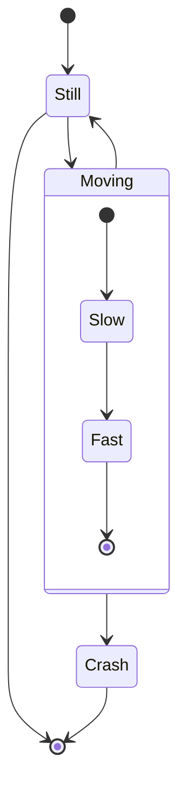

# stateDiagram Implementation Plan

**Goal:** Add stateDiagram support to palette-mermaid, including models, parser, layout, and rendering.

**Architecture:** Follow the same pattern as classDiagram/erDiagram - models, parser, layout, rendering.

## stateDiagram Syntax Reference



**Key Elements:**
- States: `state_name`, `state "Description"`
- Transitions: `state1 --> state2`, `state1 --> state2 : event`
- Start/End: `[*]`
- Composite states: `state name { ... }`
- Notes: `note right of state : text`
- Fork/Join: `state fork_state <<fork>>`, `state join_state <<join>>`

---

## Task 1: Add stateDiagram models

**Files:**
- Modify: `palette-mermaid/src/commonMain/kotlin/xyz/junerver/compose/palette/mermaid/MermaidModels.kt`

- [ ] **Step 1: Add StateDiagram to MermaidDiagramType**

```kotlin
enum class MermaidDiagramType {
    Flowchart,
    Sequence,
    ClassDiagram,
    ErDiagram,
    StateDiagram,
}
```

- [ ] **Step 2: Add state models**

```kotlin
// ── State Diagram models ──────────────────────────────────────────────

data class StateDefinition(
    val id: String,
    val label: String? = null,
    val isStart: Boolean = false,
    val isEnd: Boolean = false,
    val isFork: Boolean = false,
    val isJoin: Boolean = false,
    val children: List<StateDefinition> = emptyList(),
    val sourceRange: MermaidSourceRange? = null,
)

data class StateTransition(
    val from: String,
    val to: String,
    val event: String? = null,
    val sourceRange: MermaidSourceRange? = null,
)

data class StateNote(
    val stateId: String,
    val text: String,
    val position: StateNotePosition = StateNotePosition.Right,
)

enum class StateNotePosition {
    Left, Right,
}
```

- [ ] **Step 3: Add state fields to MermaidDiagram**

```kotlin
data class MermaidDiagram(
    // ... existing fields ...
    val stateDefinitions: List<StateDefinition> = emptyList(),
    val stateTransitions: List<StateTransition> = emptyList(),
    val stateNotes: List<StateNote> = emptyList(),
)
```

- [ ] **Step 4: Run tests and commit**

---

## Task 2: Add stateDiagram parser

**Files:**
- Modify: `palette-mermaid/src/commonMain/kotlin/xyz/junerver/compose/palette/mermaid/MermaidParser.kt`

- [ ] **Step 1: Add stateDiagram type detection**

```kotlin
if (line.equals("stateDiagram", ignoreCase = true) || line.equals("stateDiagram-v2", ignoreCase = true)) {
    type = MermaidDiagramType.StateDiagram
    direction = MermaidDirection.TopDown
    return@forEachIndexed
}
```

- [ ] **Step 2: Add state parsing logic**

Key patterns to parse:
- `state_id` : State declaration
- `state "label" as state_id` : State with label
- `[*]` : Start/end state
- `state1 --> state2` : Transition
- `state1 --> state2 : event` : Transition with event
- `state name { ... }` : Composite state
- `state fork_state <<fork>>` : Fork
- `note right of state : text` : Note

- [ ] **Step 3: Run tests and commit**

---

## Task 3: Add stateDiagram layout

**Files:**
- Modify: `palette-mermaid/src/commonMain/kotlin/xyz/junerver/compose/palette/mermaid/MermaidLayoutEngine.kt`

- [ ] **Step 1: Add StateDiagram routing**

```kotlin
if (diagram.type == MermaidDiagramType.StateDiagram) return layoutStateDiagram(diagram)
```

- [ ] **Step 2: Implement layoutStateDiagram**

Similar to flowchart layout but:
- Start/end states use circle shape
- Regular states use rectangle shape
- Composite states are nested

- [ ] **Step 3: Run tests and commit**

---

## Task 4: Add stateDiagram rendering

**Files:**
- Modify: `palette/src/commonMain/kotlin/xyz/junerver/compose/palette/components/mermaid/MermaidDiagram.kt`

- [ ] **Step 1: Add StateDiagram routing**

```kotlin
MermaidDiagramType.StateDiagram ->
    StateDiagramMermaidDiagram(
        modifier = modifier,
        colors = colors,
        layout = resolvedLayout,
        stateDefinitions = parsedDiagram?.stateDefinitions.orEmpty(),
    )
```

- [ ] **Step 2: Add StateDiagramMermaidDiagram composable**

- Start/end states rendered as small circles
- Regular states rendered as rectangles with labels
- Composite states rendered as nested boxes
- Transitions rendered as arrows

- [ ] **Step 3: Run tests and commit**

---

## Task 5: Add stateDiagram tests

- [ ] **Step 1: Add parser tests**
- [ ] **Step 2: Add UI tests**
- [ ] **Step 3: Run tests and commit**

---

## Final Verification

- [ ] Run all tests
- [ ] Run coverage checks
- [ ] Update competitor_analysis.md
